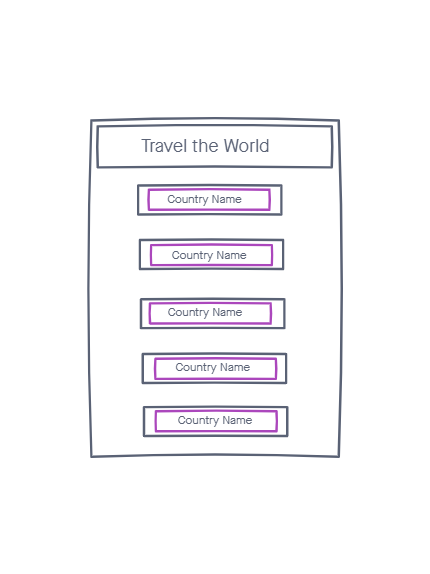
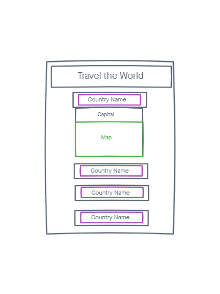

# js-401d42-class-41

## App: Travel the World
- This app allow user to search countries in the Americas for travel.

- The app would display all the countries names in the Americas as a button

- When the user click the button for the country the capital city and map od the country would display.

## How to use

- After you download app from the app store.

- You will have options to push a button for a country to vist

- You will see the countries capital and map

## Technologies

- [React Native](https://reactnative.dev/)
  - mobile application framework 

- [Expo](https://docs.expo.dev/index.html)
  - build and publish

- [React Native Elements](https://reactnativeelements.com/docs/)
  - Styling

- [RESTful API Countries](https://restcountries.com/#api-endpoints-v2-continent)
  - Get information about countries via a RESTful API

- [OpenLayers Map](https://openlayers.org/en/latest/apidoc/)
  - Map Api display

## UML

